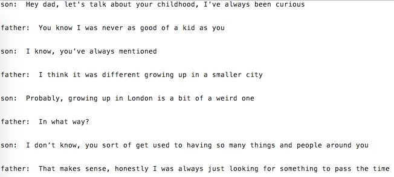
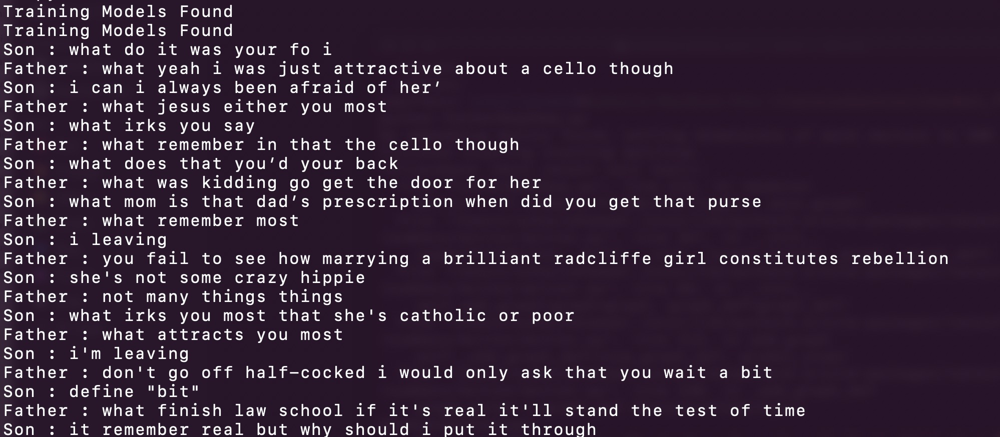
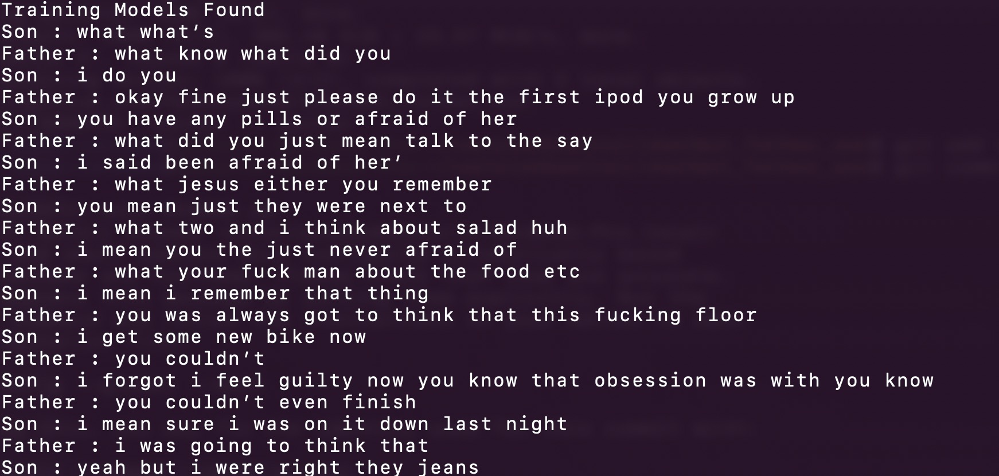

# Father-Son-Chatbot

## Overview

For this project, I wanted to train a Sequence To Sequence model on some conversation logs of Father-Son conversation dataset. Let me explain how you can train the chatbot.

## Requirements and Installation
In order to run these scripts, you'll need the following libraries.

* **[TensorFlow](https://www.tensorflow.org/install/) version 1.0 or later**
* [NumPy](https://docs.scipy.org/doc/numpy/user/install.html)
* [Pandas](https://pandas.pydata.org/pandas-docs/stable/install.html)
* [Sklearn](http://scikit-learn.org/stable/install.html)

## How You Can Train

1. Download and unzip [this entire repository from GitHub](https://github.com/Pphhaaaddd/chatbot_father_son), either interactively, or by entering the following in your Terminal.
    ```bash
    git clone https://github.com/Pphhaaaddd/chatbot_father_son
    ```

2. Navigate into the top directory of the repo on your machine
    ```bash
    cd chatbot_father_son
    ```
3. The first job is to get Chat Data samples from different sources and put them in '''files''' folder. Make sure the txt files are in the following format:

  

### If you don't have any Chat Data samples, use our pre-trained model. Skip to step 7.
4. Now that we have all our conversation logs, we can go ahead and create our dataset. In our directory, let's run:
    ```bash
    python createDataset.py
    ```
    This will create Conversation Data for both Father and Son. This script will create a files named **sonConversationDictionary.npy** and **fatherConversationDictionary.npy** which are Numpy objects that contains pairs in the form of (MESSAGE, RESPONSE). File named **sonConversationData.txt** and **fatherConversationData.txt** will also be created. These are simply large text files the dictionary data in a unified form.

5. Now that we have these files, we can start creating our word vectors through a Word2Vec model. This step is a little different from the others. The Tensorflow function we see later on (in SonSeq2seq.py and FatherSeq2Seq.py) actually also handles the embedding part.
    ```bash
    python SonWord2Vec.py
    python FatherWord2Vec.py
    ```
    If you run word2vec.py in its entirety, this will create different wordlist files for Father and Son. **SonWordList.txt** and **FatherWordList.txt**, which simply contains all of the unique words in our corpus.

6. Now, we can use create and train our Seq2Seq model.
    ```bash
    python SonSeq2Seq.py
    python FatherSeq2Seq.py
    ```
    This will create more different files. **SonSeq2SeqXTrain.npy**, **SonSeq2SeqYTrain.npy**, **FatherSeq2SeqXTrain.npy** and **FatherSeq2SeqYTrain.npy** are the training matrices that Seq2Seq will use. Again, we save these just in case we want to make changes to our model architecture, and we don't want to recompute our training set. The last file(s) will be .ckpt files which holds our saved Seq2Seq model. Models will be saved at different time periods in the training loop. These will be used and deployed once we've created our chatbot.

7. Now that we have a saved model, let's now create our chat session.

    ```bash
    python createConversation.py
    ```

There you go. You should be able to see around 10 lines of conversation between father and son bots. You can pass arguments as initial Son chat and the total number of conversation lines you want. As shown below :
    ```bash
    python createConversation.py "Hi, How are you?" 20
    ```

In case you want to add more training conversation, add them to files directory in txt and in to shown format above. You'll have to run all the commands again to rebuild the models.

## Sample(s)





## Contribution(s)

1. [This repository](https://github.com/adeshpande3/Facebook-Messenger-Bot) and [this blog-post](https://adeshpande3.github.io/adeshpande3.github.io/How-I-Used-Deep-Learning-to-Train-a-Chatbot-to-Talk-Like-Me).
2. Also check [this video](https://www.youtube.com/watch?v=pY9EwZ02sXU) and [this notebook](https://github.com/llSourcell/word_vectors_game_of_thrones-LIVE/blob/master/Thrones2Vec.ipynb).

**Please let me know if you have any issues or if you have any suggestions for making this README better. If you thought a certain step was unclear, let me know and I'll try my best to edit the README and make any clarifications.**
